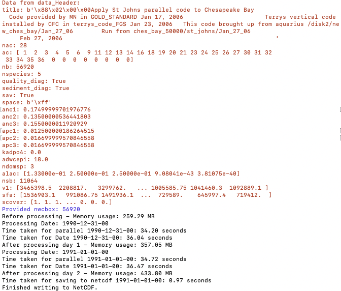
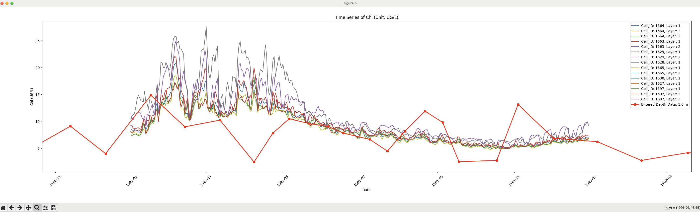
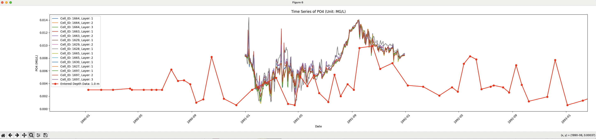

**Deciphering the wqm_apl.run and Writing it to NetCDF, Followed by Tools to do the Comparison of the Observation and Simulated Time Series Data**

**Task Overview**

The task involves using three files provided by Richard Tian from CBP to
convert the binary unformatted output file, wqm_apl.run, into a
sustainable NetCDF format for future use. The files required are:

1.  col_cbay_56920.dat

2.  col_cbay_56920xy.csv

3.  wqm_apl.run

The wqm_apl.run file contains binary unformatted output data written in
Fortran. The col_cbay_56920.dat and col_cbay_56920xy.csv files provide
the mapping between Cell_ID, I, J, Layer#, UTM-X, and UTM-Y. Richard
Tian also provided a Fortran77 code to read the binary output. Our goal
is to write a Python script that deciphers the wqm_apl.run file and
converts the time series data for each variable into a NetCDF format,
ensuring it is accessible and sustainable for future use.

**Code Structure**

**Preprocessing**

**Script:** Cell2LonLat.py\
**Required Files:** col_cbay_56920.dat and col_cbay_56920xy.csv\
This script merges the information from the two input files to generate
the Cell2LonLat.csv file, which contains the longitude and latitude data
for each cell. This CSV file is essential for the next step.\
\
*You should see below in your terminal:

**Deciphering**

-   **Configuration File:** config.json

-   **Main Script:** Decipher.py

-   **Utility Script:** utils.py

Modify the config.json file to specify parameters such as the output
directory. Then, run Decipher.py, which uses functions defined in
utils.py and the configurations set in config.json. Generally, you do
not need to modify utils.py or Decipher.py.

*You should see below in your terminal:

*...*

**Checking Data Saved in NetCDF**

-   **Reader Script:** netCDFReader.py

-   **GUI Tool:** probe_GUI.py

The netCDFReader.py script allows you to read and verify the NetCDF
output, which contains time series data with all variables available from the simulation output. The
probe_GUI.py provides an interface for exploring the data. It enables
users to identify the nearest six grid points to a selected location and
visualize basic time series plots based on the selected point.

*GUI Interface Example

**Compare the NetCDF output with Fortran output**

-   **Fortran Script:** skill_r223_mde_allv.f(not provided here, please request it from Richard Tian)

-   **We provide some sample output from Fortran and do comparison:** See Fortran output.xlsx

**Select Mornitoring Station and do the Comparison of the Observation and Near Simulation Grid Time Series Data**

-   **GUI Tool:** ObsVSSim.py

-   **Data needs:** 1. Simulation Output (the deciphered netCDF file)
                    2. Observation Data (wq_do_chla_po4.csv, etc)
*GUI Interface Example

